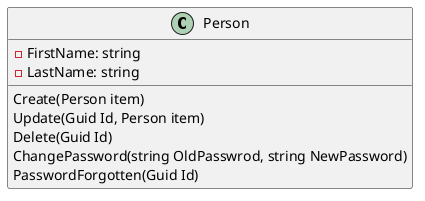
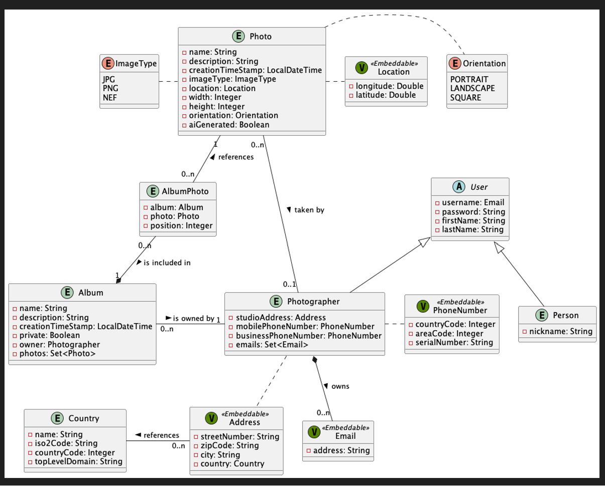

# Project

Beschreibung vom Projekt

## Zweck

x

## Team

* A
* B

## Technologie

x

## Libraries

x

## Domain Model

x

```
@startuml
Foo --> Bar
@enduml
```





Country-Klasse

``` C#

public class Country
{
    public Country(
        string name, 
        string iso2Code, 
        int conuntryCode, 
        string topLevelDomain)
    {
        Name = name;
        Iso2Code = iso2Code;
        ConuntryCode = conuntryCode;
        TopLevelDomain = topLevelDomain;
    }

    public string Name { get; set; } = string.Empty;
    public string Iso2Code { get; set; } = string.Empty;
    public int ConuntryCode { get; set; }
    public string TopLevelDomain { get; set; } = string.Empty;
}

```


